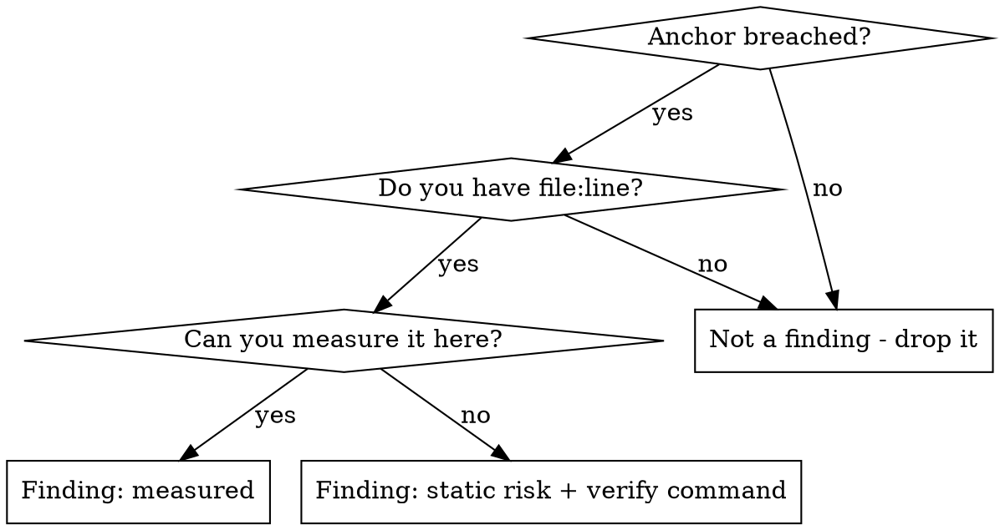

# Performance Review

## Purpose

Turn "this feels slow" into a ranked list of findings, each carrying evidence, the
named bound it breaches, a fix, and the expected delta.

The output is a review, not a rewrite. Do not change code during Phases 0-3.

**Companion file:** `performance-knowledge.md` in this directory holds the
calibration constants and domain laws — latency ladder, universal laws, symptom
triage matrix, per-dimension rules. **This file owns the PROCEDURE and the GATES;
that file owns the NUMBERS.** Consult it by section (`§n`) at the points marked
below. Never quote a number from it without reading the section around it.

---

## The Iron Law

**NO FINDING WITHOUT EVIDENCE.**

Evidence is exactly one of two things:

1. **A local measurement** — a timing, a query plan, a profile, a metric, a query
   count, a row count, a heap graph, a log line. Cite it with where it came from.
2. **A `static risk` label** — the code shape provably breaches a known bound but
   you could not run it. The finding must say `static risk` in plain text **and**
   carry the exact command, query, or dashboard that would confirm it.

Anything else is a guess wearing a number. Delete it — do not downgrade it to
"possible issue" and keep it.

**A breached anchor is a HYPOTHESIS, not a finding.** The knowledge file
calibrates severity; it never supplies the proof.

---

## When to use

- Reviewing a diff, endpoint, query, page, or service for performance
- A reported symptom: slow, timing out, spiky, growing memory, degrading over days
- Capacity, pool sizing, scaling, or "will this hold at 10x" questions
- Before shipping anything on a hot path or in a request fan-out

**Not for:** correctness bugs that merely look slow, style cleanups, or
speculative micro-optimization with no reported symptom and no budget.

---

## Phase flow

```
Phase 0  Triage         symptom + budget + ranked hypotheses
   |     GATE: no code reading for "opportunities" before this exists
Phase 1  Path map       every hop on the hot path, physics marked
   |     GATE: you can say where time goes, or which measurement would say
Phase 2  Baseline       distributions, laws checked, anchors compared
   |     GATE: every surviving hypothesis has file:line + evidence
Phase 3  Deep pass      only the dimensions the path actually touches
   |     GATE: each finding has a fix and an expected delta
Phase 4  Rank + report
```

---

## Phase 0 — Triage

1. **State the symptom in one sentence.** If the request is a bare "make it
   faster" with no symptom, either ask for one or derive it from the hottest path
   — and say in the report which you did.
2. **Find the governing budget.** SLA, SLO, spec, config timeout, product
   requirement, existing alert threshold. Search the repo for it before assuming
   none exists. **A local budget always overrides the knowledge file.** If there
   is genuinely none, state the target you are reviewing against and mark it as
   your assumption.
3. **Match symptom to usual cause** using `performance-knowledge.md` §3. Write
   2-3 ranked hypotheses, each with the first evidence it needs.

**GATE 0:** do not start reading code hunting for "optimization opportunities"
before you have a symptom, a budget, and a ranked hypothesis list. Skipping this
produces generic advice, not a review.

---

## Phase 1 — Path map

Trace the hot path end to end and list every hop:

- process and network boundaries (each one costs a round trip)
- database queries, and whether any run per row
- cache reads, and their hit ratio
- disk and serialization
- queues, locks, and thread/connection pool entrances
- fan-out points — mark the fan-out width

Then annotate:

- **Physics vs code.** Geography, handshake RTTs, and availability-in-series are
  hard floors (§1, §4). A hop already consumed by distance cannot be fixed by
  optimizing the code inside it.
- **Fan-out.** Any scatter-gather turns a backend p99 into the user's median
  (§2 tail amplification). Note the width; it changes the math.
- **Series dependencies.** Count them — availability multiplies (§1).

Anything off the hot path is out of scope for this pass. Record it as *deferred*
with one line; do not review it.

**GATE 1:** you must be able to say where the time goes, or name precisely which
measurement would tell you. "Probably the database" is not either.

---

## Phase 2 — Baseline and calibration

**Consult `performance-knowledge.md` §1 (latency ladder), §2 (universal laws), §10 (measurement rigor).**

1. **Take the baseline as a distribution.** p50/p90/p99/p99.9 + max, segmented by
   endpoint/tenant/region. Never a mean; never an averaged percentile (§10).
   State the environment, the data volume, the cache state, and whether the load
   model was open or closed — a closed-model number hides queueing collapse.
2. **If you cannot run it**, say so once at the top of the report and label
   **every** finding `static risk`. Do not silently switch between measured and
   inferred findings.
3. **Check the universal laws BEFORE blaming any component (§2).** Component
   tuning cannot fix a system-level law:
   - p99 bad while p50 is fine → saturation/queueing signature. Measure
     pool acquire-wait and queue depth at the pool entrance *first*.
   - Utilization above ~70-80% → the knee explains the latency without any
     code being at fault.
   - A serial section (global lock, single writer) caps every speedup (Amdahl).
   - Throughput fell when nodes were added → coherency cost (USL), not capacity.
   - Any unbounded queue → a latency and OOM problem, not a throughput one.
4. **Compare each hop to the ladder (§1).** A hop costing ~100x its rung is your
   hypothesis. Sequential vs random on the same bytes is 10-100x. Per-request
   handshakes cost >= 2 RTTs before the first application byte (§4).

**GATE 2 — the evidence gate:**



---

## Phase 3 — Dimension deep pass

**Run only the dimensions the hot path actually touches.** For each, read the
matching section of `performance-knowledge.md` (§4-§9) before judging severity.

| Dimension | Section | Highest-yield checks | First evidence |
| --- | --- | --- | --- |
| Network / protocol | §4 | connection reuse, per-request handshakes, chatty call counts, timeouts, LB slow-start, ephemeral-port and fd limits | call count x RTT, keep-alive state |
| Database | §5 | N+1 and per-row round trips, index leftmost-prefix and selectivity, `SELECT *`, OFFSET pagination, transaction span, pool size | query count vs item count, EXPLAIN with estimated vs actual rows |
| Caching | §6 | hit ratio, key scoping, TTL jitter and stampede protection, bounds, cold start after deploy | measured hit ratio + origin latency delta |
| Web / frontend | §7 | LCP/INP/CLS at the 75th percentile of **field** data, render-blocking assets, long tasks > 50 ms, JS bytes, layout thrash, third-party scripts | RUM/field data; lab scores only name causes |
| Runtime / memory / GC | §8 | allocation rate, unbounded caches and listeners, working set vs cache size, blocked event loop, pool sizing, lock granularity | GC log, heap growth curve, off-CPU flame graph |
| Distributed / load | §9 | timeout budget decreasing down the stack, retry backoff + jitter + budget, idempotency, bulkheads, load shedding, autoscaling signal | retry rate, dependency saturation, queue age |

Two dimension rules that override intuition:

- **Frontend (§7): field data defines truth, lab tools find causes.** Never close
  a Core Web Vitals finding on a Lighthouse score alone.
- **Database (§5): a full scan is not always wrong.** Above roughly 5-20%
  selectivity a sequential scan beats index lookups — never file "add an index"
  without the selectivity number.

**GATE 3:** every finding carries a fix and an expected delta. A finding you
cannot propose a fix for is a *question*, and belongs in an "unknowns" list.

---

## Phase 4 — Rank and report

### Severity rubric

| Severity | Meaning |
| --- | --- |
| **Critical** | Breaches a stated budget on the hot path for all traffic, **or** is an availability risk: unbounded queue/cache, missing timeout, retry storm, pool exhaustion, connection leak, transaction held across a network call |
| **High** | Measured breach of an anchor by >= 10x on a path most requests take, or an approaching cliff (utilization past the knee, working set near cache size, hot key/partition) |
| **Medium** | Measured breach on a narrower path, or a scaling defect that is fine today and breaks at a stated growth multiple — **name the multiple** |
| **Low** | Real but small, or off the hot path. Batch these at the end; never lead with them |

**Downgrade one level when the evidence is `static risk` rather than measured.**

### Finding format

```text
### [HIGH] N+1 on order lines — app/Http/Controllers/OrderController.php:42

Evidence     measured — GET /orders p95 412 ms; 241 queries for 240 rows (query log)
Bound        §5 per-row round trip; 240 x ~0.5 ms intra-DC RTT = ~120 ms floor
             from round trips alone, before any query execution
Fix          eager-load the relation; one batched IN query
Delta        241 queries -> 2; expected p95 ~40-60 ms
Verify       re-run with query log on; assert query count <= 3
Trade        larger single result set; check row width before batching >1k ids
```

For a `static risk` finding, the Evidence line reads:

```text
Evidence     static risk — verify with: EXPLAIN ANALYZE SELECT ... (check actual
             rows vs estimated, and whether idx_orders_user is used)
```

### Report skeleton

1. **Baseline** — what was measured, in what environment, with what data volume
   and load model. Or a single explicit "could not run; all findings are static
   risk".
2. **Verdict** — does the hot path meet the governing budget, and where the time
   actually goes.
3. **Findings** — ranked, in the format above.
4. **Deferred / out of scope** — one line each.
5. **Unknowns** — what you could not determine and the measurement that would.

---

## Fix discipline

- **Fix the dominant term.** A 40% win on 5% of the time is noise. Order fixes by
  measured contribution, not by ease.
- **Never propose a code fix for a budget already consumed by physics.** If RTT,
  handshakes, or series availability eat the budget (§1, §4), the fix is an
  edge/replica/protocol change or a renegotiated budget.
- **Escalate data scaling in order (§5):** tune query/index -> cache -> vertical
  -> read replicas -> partition -> shard. Proposing sharding first is the
  expensive mistake.
- **Every fix names its trade.** Indexes slow writes. Caches add staleness.
  Relaxed fsync trades durability. Async trades complexity. State it.
- **Every fix names its verification.** The command, metric, or assertion that
  proves the delta after the change.

---

## Rationalizations — all of these mean STOP

| Excuse | Reality |
| --- | --- |
| "It's obviously slow" | Obvious to you is not a number. Measure or label `static risk`. |
| "The anchor says 100x, that's enough" | The anchor calibrates severity; it is not evidence about **this** system. |
| "I can't run it, so I'll just flag it softly" | Label it `static risk` and give the verify command, or drop it. There is no third state. |
| "The mean latency looks fine" | Means hide tails. Report distributions (§10). |
| "p99 is bad, so the query is slow" | Bad p99 with a fine p50 is queueing/saturation. Check the pool entrance first (§2). |
| "Adding an index will fix it" | Not without the selectivity number, and not without pricing the write cost (§5). |
| "Lighthouse gives it a 95" | Lab finds causes; field data defines truth (§7). |
| "We added a cache, so caching is done" | Value = hit ratio x latency delta. Without the ratio you have added a bug surface (§6). |
| "More servers will fix throughput" | USL: past a point more nodes reduce throughput (§2). |
| "It's fast on my machine" | Realistic data volume and cache state, or the result is fiction (§10). |
| "This micro-optimization can't hurt" | It costs review time and readability for an unmeasured gain. Not a finding. |
| "The knowledge file says 2.5 s, so 2.6 s is a bug" | Local SLA/spec/config wins. That file calibrates; it does not govern. |

---

## Red flags in the report you are writing

- A finding with a number but no source for the number
- A percentile that was averaged across instances
- "Should be faster" / "could be optimized" with no delta
- A fix with no trade-off named
- An index recommendation with no selectivity or plan
- A Core Web Vitals claim sourced from a local run
- A list of ten Low findings and no baseline
- Any anchor quoted from `performance-knowledge.md` as if it were a requirement

---

## Final rule

The knowledge file makes severity **judgeable**; this procedure makes findings
**true**. Quoting a constant without measuring this system is the exact
guess-as-fact failure the skill exists to prevent — and a correct anchor attached
to an unproven claim is more dangerous than no anchor, because it reads as rigor.
